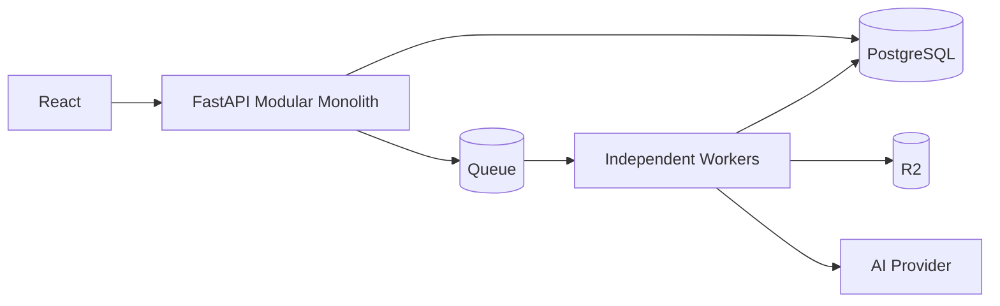
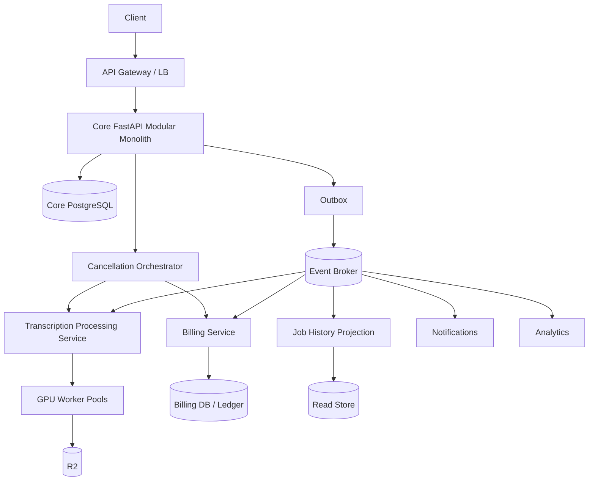

# Day 7 — Design Lab: Evolve the Transcription SaaS Without Summoning Kubernetes Demons 😄

## Mission

Start from a modular monolith + independent workers and evolve only the parts for which new requirements justify architectural complexity.

Do not begin with the target architecture.

Begin with **pressure**.

## Timebox

- 20 min — baseline architecture
- 25 min — identify pressures
- 35 min — pattern decisions
- 30 min — migration sequence
- 20 min — failure/consistency review
- 20 min — write ADR and defend it aloud

---

# 1. Baseline



Modules:

```text
Identity
Uploads
Jobs
Results
Billing
Notifications
Admin
```

This is your default.

---

# 2. New business pressure

Three years later:

### Scale

- 250k users,
- 100k transcription hours/day,
- job-history reads are 200× job lifecycle writes,
- GPU workers span several pools/providers.

### Teams

- Core Platform owns Jobs/Uploads,
- FinOps team owns Billing,
- ML Platform owns transcription execution,
- Growth owns notifications.

### Product

- enterprise audit history must reconstruct usage adjustments,
- billing changes require strict auditability,
- cancellation spans processing + quota + billing,
- analytics/search/email all react to job completion,
- enterprise dashboard requires very fast filtered job history.

### Reliability

- billing outage must not block transcription completion,
- notification outage must not block anything important,
- search may lag up to 60 seconds,
- user cancellation must be durably tracked.

---

# 3. Pattern decision matrix

Fill this before drawing the final architecture:

| Problem | Current pain | Candidate pattern | Benefit | New complexity | Decision |
|---|---|---|---|---|---|
| Module coupling | | Modular monolith strengthening | | | |
| Independent ML scaling | | Microservice/runtime extraction | | | |
| JobCompleted consumers | | Event-driven | | | |
| Job history 200× reads | | CQRS | | | |
| Billing audit history | | Event sourcing / immutable ledger | | | |
| Cancellation workflow | | Saga | | | |

---

# 4. Recommended evolutionary answer

A reasonable solution might be:



But this is **not automatically the correct answer**.

You must justify every box.

---

# 5. Likely decisions to defend

## Keep Core as modular monolith

Why?

Identity, Uploads, Jobs and Results may still share:

- one team,
- high transactional cohesion,
- similar release cadence,
- simple local consistency needs.

No need to fragment them merely because the company has grown.

---

## Extract transcription processing

Possible reasons:

- GPU-specific runtime,
- independent autoscaling,
- ML team ownership,
- different deployment cadence,
- different failure/capacity model.

The extraction solves a real operational boundary.

---

## Extract Billing

Possible reasons:

- separate team,
- security/compliance boundary,
- independent release cadence,
- authoritative usage/financial state,
- stricter audit requirements.

But now cross-service workflows need explicit consistency handling.

---

## Introduce event-driven `JobCompleted`

Why?

```text
JobCompleted
  ├── Billing usage finalization
  ├── Notifications
  ├── Analytics
  └── Search/read projection
```

The producer should not synchronously wait for all of these.

---

## Introduce CQRS for job history only

Write side remains authoritative in Core PostgreSQL.

Read-heavy UI uses a projection.

```text
Core DB
 ↓ events
JobHistory projection
 ↓
optimized read store
```

Do **not** CQRS every endpoint.

---

## Event sourcing? Maybe only Billing—and maybe not even there

Question:

Do enterprise requirements need:

```text
complete immutable sequence of billing/usage decisions
+
replay/reconstruction as core functionality
```

If yes, event sourcing or a carefully designed append-only ledger may help.

If immutable ledger rows already meet audit requirements, full event sourcing may still be unnecessary.

---

## Saga for cancellation

Once Jobs, ML processing and Billing have independent transactions:

```text
Cancel
 ↓
Jobs CANCELLING
 ↓
ML stop
 ↓
Billing release quota/refund
 ↓
Jobs CANCELLED
```

Use durable orchestration if sequencing and compensation are important.

---

# 6. Consistency contracts

Define expected consistency per interaction:

| Interaction | Required consistency |
|---|---|
| User cancels job | authoritative write immediately |
| Search/job-history projection | ≤60s lag acceptable |
| Notification | eventual, minutes acceptable |
| Billing balance | authoritative / strong within billing boundary |
| Analytics | eventual |
| Job detail immediately after command | read-your-write required |

Architecture patterns are only correct relative to these contracts.

---

# 7. Migration sequence

Do **not** migrate everything at once.

A possible roadmap:

```text
Step 1
Enforce modular boundaries inside Core

Step 2
Introduce internal domain events + outbox

Step 3
Extract ML processing behind existing queue contract

Step 4
Add job-history projection (CQRS read side)

Step 5
Extract Billing only after contract/ownership stabilizes

Step 6
Introduce cancellation saga because transactions now cross services

Step 7
Evaluate event sourcing only if audit/replay requirement remains unmet
```

Notice how event sourcing is last, not first. 😄

---

# 8. Failure review

For the evolved architecture, answer:

1. Broker is unavailable after Core commits `JobCompleted`.
2. Billing consumes `JobCompleted` twice.
3. Job-history projection is 20 minutes behind.
4. ML service is unavailable during cancellation.
5. Saga orchestrator crashes mid-cancellation.
6. Billing ledger accepts a charge but response is lost.
7. Event schema v3 is published while one consumer understands only v2.
8. Core and Billing need to deploy incompatible API changes.

For each, identify:

```text
source of truth
failure containment
retry/idempotency
acceptable user behavior
recovery mechanism
observability signal
```

---

# 9. Architecture decision record

Write a final ADR containing:

```text
Context
Current architecture
Observed pressures
Patterns considered
Patterns rejected
Chosen changes
Consistency implications
Operational cost
Migration sequence
Rollback strategy
Metrics / review triggers
```

Your ADR should explicitly contain at least **three “not yet” decisions**.

Example:

```text
Event sourcing: NOT YET
Reason: current audit requirement is satisfied by append-only usage ledger; replayable aggregate history does not justify the migration cost.
```

That is mature architecture.

---

# 10. Oral defense prompts

Give yourself 2 minutes each:

1. Why not split Core into five microservices?
2. Why extract transcription processing?
3. Why is `JobCompleted` a good event?
4. Why is job history a CQRS candidate?
5. Why might Billing justify event sourcing while Jobs does not?
6. Why does service extraction create the need for sagas?
7. What would make you reverse one of these decisions?

---

## Graduation criterion

You can evolve the system one boundary at a time and explain **which requirement paid for each new architectural pattern**.
