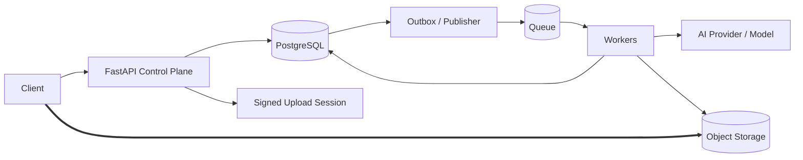

# Day 4 — High-Level Architecture & 10× / 100× / 1000× Thinking

## Goal

Draw the simplest architecture that satisfies today's assumptions, then scale it by finding evidence-backed bottlenecks.

---

# 1. Start simple

Example:

```text
Client
  ↓
API
  ↓
PostgreSQL
```

If this satisfies the stated traffic and reliability requirements, it is a legitimate starting architecture.

Do not begin with:

```text
Global CDN
API Gateway
Service Mesh
Kafka
Redis Cluster
Cassandra
ElasticSearch
Kubernetes
17 microservices
```

unless requirements force them.

---

# 2. Draw flows, not logos

A useful diagram answers:

```text
Where does data enter?
Where is state authoritative?
Where does async work start?
Where do large bytes flow?
Where are expensive dependencies?
```

For transcription:



---

# 3. Bottleneck analysis

For every main component ask:

```text
capacity unit?
metric that reveals saturation?
what happens at saturation?
scale-up option?
scale-out option?
failure mode introduced by scaling?
```

Example — PostgreSQL:

```text
Signals:
connection utilization
CPU
IOPS
lock waits
query p95
replica lag

Options:
indexes
query changes
pooling
caching
read replica
partitioning
sharding (later)
```

---

# 4. 10× / 100× / 1000×

Do not respond to each level by adding a fashionable technology.

Use this worksheet:

### 10×

```text
First metric likely to saturate:
Evidence I would collect:
Smallest useful change:
New failure mode introduced:
```

### 100×

Same questions.

### 1000×

Same questions.

---

# 5. Example — URL shortener

Initial:

```text
Client → API → PostgreSQL
```

At rising read traffic:

```text
Client → LB → APIs → Redis → PostgreSQL
```

At extreme globally distributed hot reads:

```text
Client → Edge/CDN → LB → APIs → Redis → PostgreSQL
```

The scaling path follows measured pressure:

```text
DB repeated hot reads
→ cache

global latency/origin pressure
→ edge
```

not:

```text
startup founded
→ CDN + Redis immediately
```

---

# 6. Single points of failure

For the high-level design, identify:

```text
load balancer
primary DB
broker
object storage/provider
AI provider
regional dependency
```

Then distinguish:

```text
managed HA built into dependency
vs
architecture you must design yourself
```

---

# 7. Cross-cutting pass

Before leaving the architecture, do a fast pass:

### Reliability

```text
timeouts
retries
idempotency
DLQ
failover
```

### Security

```text
authn/authz
private data
signed access
rate limits
abuse
```

### Observability

```text
logs
metrics
traces
SLOs
```

### Cost

```text
bytes
storage
compute/GPU
managed-service premium
egress
```

---

# Exercise

Take:

```text
React → FastAPI → PostgreSQL
```

Design its evolution for:

```text
10×
100×
1000×
```

but write a metric beside every new component.

Example:

```text
Redis
Trigger:
DB read QPS / p95 indicates repeated hot reads
```

If you cannot name a trigger, don't add the box yet.

---

# Retrieval quiz

1. Why start simple?
2. What is a useful architecture diagram supposed to show?
3. Name four DB saturation signals.
4. Why isn't “1000× = Kafka” a valid answer?
5. What four cross-cutting lenses should you revisit?

## Exit criterion

You can evolve a simple design based on concrete bottlenecks and explain the new failure mode created by each scaling mechanism.
