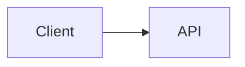

# System Design Interview Template

## Prompt

> 

## 1 — Requirements

### Functional

- 
- 
- 

### Non-functional

- Scale:
- Latency:
- Availability:
- Consistency:
- Durability:
- Security/privacy:

### Out of scope

- 
- 

### Assumptions summary

> 

---

## 2 — Scale estimation

| Quantity | Assumption | Estimate | Architectural implication |
|---|---:|---:|---|
| Users | | | |
| Avg RPS | | | |
| Peak RPS | | | |
| Storage/day | | | |
| Bandwidth | | | |
| Async work/sec | | | |

---

## 3 — API design

```http

```

Retry/idempotency notes:

---

## 4 — Data model

```text

```

Main access patterns:

- 
- 

Authoritative facts:

- 

---

## 5 — High-level architecture



### Main flow

1. 
2. 
3. 

### Failure / security / observability / cost pass

- Failure:
- Security/privacy:
- Observability:
- Cost:

---

## 6 — Bottlenecks

### 10×

- First saturation signal:
- Smallest change:
- New failure mode:

### 100×

- First saturation signal:
- Smallest change:
- New failure mode:

### 1000×

- First saturation signal:
- Smallest change:
- New failure mode:

---

## 7 — Tradeoffs

### Decision 1

```text
Requirement:
Options:
Chosen:
Why:
Cost/tradeoff:
Revisit trigger:
```

### Decision 2

```text
Requirement:
Options:
Chosen:
Why:
Cost/tradeoff:
Revisit trigger:
```

---

## 90-second conclusion

>
