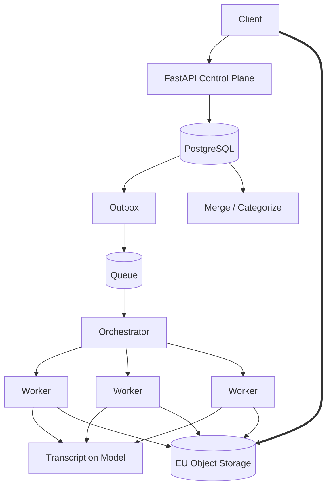

# Day 1 — Design Video Transcription 🟠

## Prompt

> Design a SaaS that accepts 1–2 hour videos and produces categorized transcripts.

This is your home-field system. The challenge is to explain it **without relying on familiarity shortcuts**.

---

# 1 — Requirements

Possible functional scope:

```text
large video upload
categories supplied by user
async transcription
chunk-level progress
categorized result
CSV export
job history
```

Non-functional:

```text
files often >1 GB
resumable uploads
minutes-long processing
EU/GDPR requirements
fault tolerance
bounded cost
```

---

# 2 — Estimation

Pick assumptions:

```text
videos/day
avg duration
avg file size
peak upload starts
chunk duration
avg chunk processing duration
```

Calculate:

```text
raw ingress/day
chunks/day
queue arrival/sec
worker concurrency
result storage
```

---

# 3 — API

Example:

```http
POST /uploads
POST /uploads/{id}/complete
POST /jobs
GET  /jobs/{id}
GET  /jobs/{id}/transcript
DELETE /jobs/{id}
```

Discuss:

```text
presigned multipart upload
idempotent completion
202 Accepted
polling/WebSocket progress
```

---

# 4 — Data model

```text
User
 ↓
Upload
 ↓
Job
 ↓
Chunk
 ↓
Transcript
```

Important invariants:

```text
one logical chunk/version
monotonic state transitions
idempotent finalization
```

---

# 5 — Architecture



---

# 6 — Bottlenecks

At scale examine:

```text
object-storage ingress
upload-init burst
DB connections
queue age
worker concurrency
provider quotas
GPU capacity
chunk stragglers
merge bottleneck
LLM categorization cost
```

---

# 7 — Tradeoffs

Defend:

```text
modular monolith + independent workers
vs microservices

Redis/RabbitMQ
vs Kafka

30–60s chunks
vs larger chunks

PostgreSQL transcript text
vs R2 object
vs hybrid
```

---

# Failure challenge

Explain recovery when:

1. chunk 37 fails,
2. worker commits artifact but dies before DB update,
3. queue redelivers,
4. user cancels during fan-out,
5. AI provider rate-limits,
6. merge succeeds but final DB update fails.

---

## Exit criterion

You can design this system in 45 minutes and spend more time explaining **failure/scale tradeoffs** than introducing technologies.
