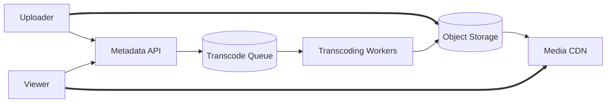

# Day 2 — Design YouTube-lite 🟠

## Prompt

> Design a global video-upload and playback platform.

Do not design YouTube's recommendation ML system. Focus on media ingestion, processing and delivery.

---

## Main architectural split

```text
UPLOAD / CONTROL
       ≠
PROCESSING
       ≠
PLAYBACK DELIVERY
```

---

# Requirements

```text
resumable video upload
metadata/title/privacy
asynchronous transcoding
multiple renditions
thumbnails
playback
view counters eventually
```

Non-functional:

```text
large files
high durability
playback start latency
massive read bandwidth
regional/global delivery
```

---

# Architecture



---

# Key decisions

## Resumable uploads

Large files should recover from network interruption without restarting from byte zero.

## Async transcoding

Video processing is long-running and can generate multiple output variants.

## Multiple renditions

```text
360p
720p
1080p
...
```

Playback clients choose an appropriate rendition/segment based on network/device conditions.

## CDN

The dominant traffic is repeated delivery of large immutable media segments — an extremely CDN-shaped workload.

---

# Estimation focus

Calculate:

```text
uploaded bytes/day
transcoding compute
stored rendition multiplier
playback egress/sec
origin offload target
```

The playback side can dwarf API traffic by orders of magnitude.

---

# Failure questions

- upload interrupted at 87%?
- transcode one rendition fails?
- origin object missing?
- CDN edge misses during viral video?
- metadata says READY before all required renditions exist?
- stale private/public ACL at edge?

---

# Tradeoff

Discuss **precompute vs on-demand transcode**.

```text
precompute
→ storage + compute cost upfront
→ predictable playback

on-demand
→ lower cold-content cost
→ first-view latency / capacity spikes
```

---

## Reference reality check

Google's current YouTube upload documentation uses resumable upload sessions, and Google Cloud's Transcoder API models transcoding as asynchronous jobs whose outputs are written back to object storage. Media CDN is explicitly designed for high-throughput streaming/large-file delivery.

## Exit criterion

You separate the metadata/API plane from the enormous media data plane and can explain why the CDN is more central to playback scale than the API servers.
