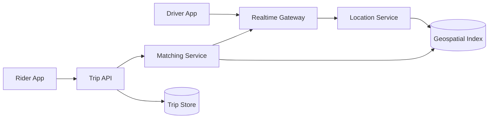

# Day 4 — Design Uber-like Dispatch 🔴

## Prompt

> Design the realtime matching layer that connects riders with nearby available drivers.

Ignore payment and trip pricing details unless needed.

---

# Main problem

You need to answer repeatedly:

> **Which available drivers are near this pickup point right now?**

Naively scanning all drivers is not an option at scale.

---

# Requirements

```text
driver location updates
rider requests
nearby driver lookup
match offer/acceptance
trip state transition
```

Non-functional:

```text
low matching latency
high update throughput
location staleness bounded
city-level failure isolation
privacy/security
```

---

# Geospatial indexing

Map coordinates into spatial cells:

```text
lat/lng
  ↓
cell ID
  ↓
nearby cells
```

Then search a small area rather than the planet.

Uber's H3 is a useful real-world reference: a hierarchical hexagonal spatial index used by Uber for marketplace/geospatial analysis.

---

# Architecture sketch



---

# Consistency question

Driver location can often be **eventually fresh within seconds**.

But match ownership must prevent:

```text
same driver
assigned to two riders
```

So different facts need different consistency guarantees.

---

# Realtime questions

- update frequency while moving?
- what if driver goes offline?
- stale location TTL?
- WebSocket/mobile push fallback?
- what happens during network partition?
- how does city/region partitioning affect failure radius?

---

# Hotspot challenge

Concert ends:

```text
50k riders
5k drivers
same small geographic area
```

Now the problem includes:

```text
hot spatial cells
contention
fairness
backpressure
queueing
```

---

## Exit criterion

You separate high-rate approximate/fresh-enough location state from strongly guarded match/trip state.
