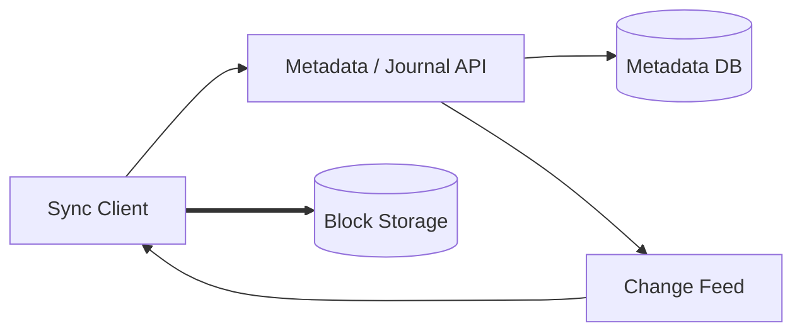

# Day 5 — Design Dropbox-lite 🔴

## Prompt

> Design a file synchronization service across a user's laptops and mobile devices.

Uploading a file is easy compared with **synchronizing a mutable filesystem across intermittently connected devices**.

---

# Requirements

```text
upload/download files
multi-device sync
offline changes
folders/metadata
revisions
conflict handling
large files
```

Non-functional:

```text
durability
sync correctness
bandwidth efficiency
fast incremental changes
long offline periods
```

---

# Separate content from metadata

A useful model:

```text
Metadata system
→ paths, revisions, ownership, folder structure

Content store
→ immutable content blocks
```

Dropbox publicly describes a similar separation: Magic Pocket stores immutable file-content blocks while metadata/revision logic lives in higher layers.

---

# Chunk/block storage

Instead of re-uploading a 5 GB file after a tiny change:

```text
File
 ↓ split
Block A
Block B
Block C
...
```

Content-addressed blocks can enable:

```text
deduplication
integrity checking
incremental transfer
immutable storage
```

---

# Sync engine problem

Each device can be:

```text
online
slow
partitioned/offline
months behind
```

When it reconnects, it must reconcile:

```text
local state
server state
other-device changes
```

Network partitions are not rare anomalies here; offline operation is normal.

---

# Conflict example

Laptop A and laptop B both edit:

```text
/report.docx
```

offline.

When they reconnect:

- last-write-wins?
- keep both conflicting copies?
- application-specific merge?
- version vector/revision history?

There is no universal answer.

---

# Architecture



---

# Deep-dive questions

- how does client learn “what changed since revision X”?
- how are blocks checksummed?
- how is deletion represented?
- how are renames distinguished from delete+upload?
- how is large-folder listing paginated?
- what happens if block upload succeeds but metadata commit fails?
- garbage collection of unreferenced blocks?

---

## Exit criterion

You understand why file sync is a consistency/reconciliation problem, not simply an object-storage upload API.
