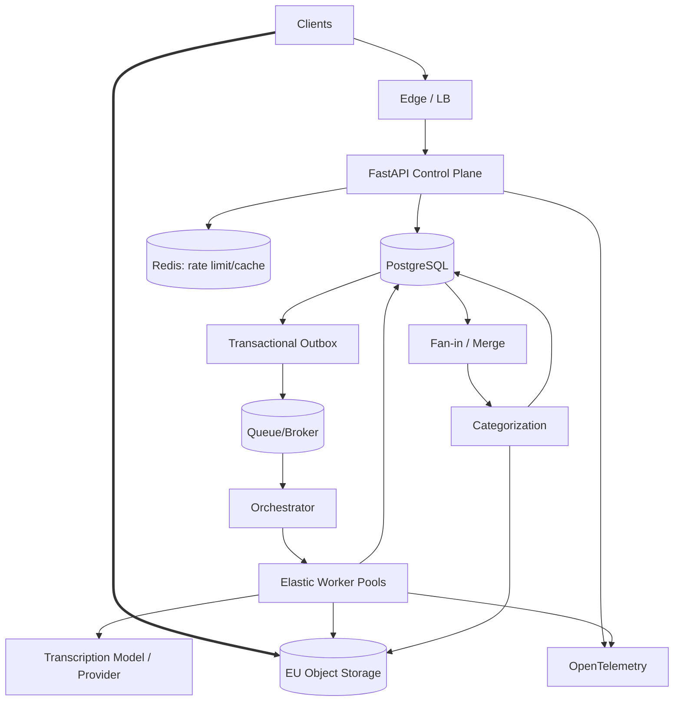

# Day 7 — Final Boss: 100,000 Transcription Hours per Day 🥷🔥

## Prompt

> Design a production platform that accepts long-form videos and transcribes **100,000 media hours per day** while providing reliable progress, categorized results, GDPR-aligned data handling, and controlled cost.

You have 60 minutes for the design and 15 minutes for hostile questions.

---

# Phase 1 — Requirements

Define:

### Functional

```text
resumable video upload
async transcription
chunk-level progress
categorization
result/export
history
cancellation
retry
```

### Non-functional

Choose explicit targets for:

```text
availability
start latency
processing completion ratio
progress freshness
retention
EU data residency
max media size
cost ceiling / customer tier
```

---

# Phase 2 — Scale estimation

Given:

```text
100,000 media hours/day
```

One-minute chunks:

```text
100,000 × 60
= 6,000,000 chunks/day
```

Average:

```text
~69.4 chunks/sec
```

Assume average chunk processing time:

```text
15 seconds
```

Average concurrency:

```text
69.4 × 15
≈ 1,041 concurrent chunk executions
```

At 3× peak:

```text
~3,125 concurrent chunk executions
```

If the media ingestion bitrate averages 2 Mbps across uploaded video:

```text
100,000 h × 3,600 sec × 2 Mbit/sec
≈ 720,000,000 Mbit/day
≈ 90 TB/day raw media
```

At 5 Mbps:

```text
~225 TB/day
```

These are assumptions, not promises.

Their job is to show that:

```text
worker capacity
object storage
provider quotas
network ingress
cost
```

are all first-class constraints.

---

# Phase 3 — API

```http
POST /uploads
POST /uploads/{id}/complete
POST /jobs
GET  /jobs/{id}
GET  /jobs/{id}/transcript
POST /jobs/{id}/cancel
DELETE /jobs/{id}
```

Discuss:

```text
idempotency
signed URLs
multipart uploads
202 Accepted
progress API
```

---

# Phase 4 — Data model

```text
users
uploads
jobs
chunks
transcripts / transcript_artifacts
outbox_events
processed_events
```

Authoritative facts:

```text
PostgreSQL → workflow state
R2/object store → durable media/result artifacts
Queue → delivery state only
```

---

# Phase 5 — Architecture



---

# Phase 6 — Bottlenecks

## 10× from MVP

Likely:

```text
DB connection pressure
provider quotas
worker backlog
large-upload reliability
```

## 100×

Likely:

```text
queue age
worker/GPU capacity
object-store operations/bandwidth
fairness across tenants
DB write bursts
```

## 1000×

Potentially:

```text
regional capacity
provider diversification
partitioned job/chunk tables
multiple worker pools
cross-region control-plane design
dedicated event/log infrastructure
```

Do not claim the exact order without measurements.

---

# Phase 7 — Tradeoffs

You must defend at least five:

### Queue

```text
Redis Streams/RabbitMQ first
vs Kafka
```

### Orchestration

```text
custom DB+queue
vs Celery
vs Temporal/managed workflow
```

### Transcription

```text
self-hosted GPU
vs external provider
vs hybrid overflow
```

### Transcript storage

```text
PostgreSQL
vs object storage
vs hybrid
```

### Consistency

```text
primary read after user mutation
vs replica for history/listing
```

### Architecture

```text
modular monolith + workers
vs extracted services
```

---

# Reliability defense

Interviewer attacks:

1. Redis unavailable.
2. Queue redelivers same chunk three times.
3. Worker finishes AI call but DB update fails.
4. R2 returns 503.
5. AI provider returns 429 for 20 minutes.
6. PostgreSQL primary fails.
7. Merge worker crashes after writing final artifact.
8. One customer submits 30% of daily volume.

For each answer:

```text
detect
contain
retry/degrade/failover
reconcile
prove recovery
```

---

# GDPR / security defense

Discuss:

```text
EU region/residency choices
processor/vendor agreements
retention/lifecycle deletion
least-privilege object access
short-lived signed URLs
encryption in transit/at rest
user deletion/export
logs without transcript/secret leakage
tenant authorization
```

GDPR compliance is not achieved by choosing an “EU server” alone; legal basis, processing agreements, minimization, retention and user rights also matter.

---

# Observability defense

Minimum:

```text
queue_depth
oldest_job_age
job_start_latency
chunk_duration p95/p99
retry rate
provider 429/5xx
worker utilization
processing media-time ratio
completion success
stuck-job count
```

Trace:

```text
API
 ↓
outbox
 ↓
queue
 ↓
worker
 ↓
AI
 ↓
R2
 ↓
DB
```

---

# Cost defense

Model cost per media hour as variables:

```text
transcription compute/provider
categorization LLM
storage
network/egress
queue/DB
observability
supporting idle capacity
```

Then ask:

```text
Can silence be skipped?
Can audio be downsampled?
Can cold media be deleted?
Can premium tiers buy priority/faster capacity?
Can provider overflow reduce idle GPU reserve?
```

---

# Final 2-minute defense

Your answer should sound approximately like:

> “The core design separates media bytes from the API control plane, stores workflow state in PostgreSQL, and uses a durable at-least-once queue feeding bounded, idempotent chunk workers. At 100k media hours/day, worker/provider capacity and storage/network dominate, so workers scale from queue age and media throughput rather than API CPU. Deterministic artifacts plus reconciliation prevent expensive duplicate transcription after ambiguous failures. I would keep the core product as a modular monolith and independently deploy worker/orchestration pools, extracting services only when ownership, runtime or scale profiles justify it. The main uncertainties I would validate are actual real-time factor, peak arrival distribution, provider quotas, storage retention, and customer-level fairness.”

---

## Graduation criterion

You can answer the hostile follow-up:

> “Why Kafka?”

with:

> “I haven't established a Kafka-shaped requirement yet.”

🥷
